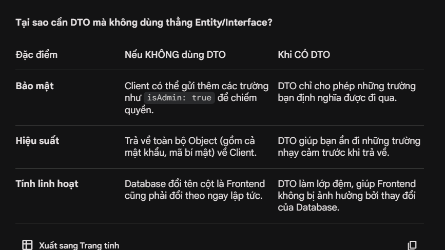

# Data Tranfer Object (DTO) 
là một mẫu thiết kế được sử dụng để truyền dữ liệu giữa các lớp hoặc tầng trong ứng dụng. DTO thường được sử dụng để đóng gói dữ liệu và truyền nó qua mạng hoặc giữa các phần của ứng dụng mà không cần phải tiết lộ chi tiết nội bộ của đối tượng.
DTO giúp tách biệt giữa các lớp hoặc tầng trong ứng dụng, giúp giảm sự phụ thuộc và tăng tính linh hoạt. Nó thường được sử dụng trong các ứng dụng web để truyền dữ liệu giữa client và server, hoặc giữa các phần của ứng dụng như controller và service.

Sơ đồ hình dung luồng đi
Client → (Gửi JSON) → DTO: DTO đóng vai trò như một cái "lọc". Ví dụ, Client gửi lên 10 trường dữ liệu, nhưng DTO của bạn chỉ định nghĩa 3 trường, thì chỉ 3 trường đó được đi tiếp.

DTO → (Dữ liệu sạch) → Service: Service yên tâm làm việc vì dữ liệu đã được định nghĩa kiểu rõ ràng (TypeScript) và đã được kiểm tra (Validation).

Service → Entity: Sau khi tính toán xong, dữ liệu mới được đổ vào Entity để lưu xuống Database.

Tuy nhiên nếu muốn áp dụng DTO thì phải kết hợp với thư viện class-validator để validate dữ liệu đầu vào. Nếu không có thư viện này thì DTO chỉ có tác dụng định nghĩa kiểu dữ liệu, nhưng không thể đảm bảo dữ liệu đầu vào là hợp lệ hay không. Việc kết hợp DTO với class-validator giúp đảm bảo rằng dữ liệu đầu vào đã được kiểm tra và hợp lệ trước khi được xử lý trong service hoặc lưu vào database.

### Lưu ý quan trọng: 
Để DTO thực sự làm được việc "lọc" này, bạn bắt buộc phải bật thuộc tính whitelist: true trong ValidationPipe ở file main.ts. Nếu không bật, dù DTO chỉ định nghĩa 3 trường, NestJS vẫn sẽ nhận đủ 10 trường từ Client gửi lên.

Chỉ dùng DTO (TypeScript): Chỉ có tác dụng lúc viết code (giúp IDE gợi ý tên biến). Khi ứng dụng đang chạy (runtime), TypeScript biến mất, dữ liệu rác vẫn có thể lọt vào.

DTO + class-validator: Giúp kiểm tra dữ liệu khi đang chạy. Nếu Client gửi sai kiểu (ví dụ gửi chuỗi vào trường số), nó sẽ chặn lại ngay tại cửa Controller và trả về lỗi 400.